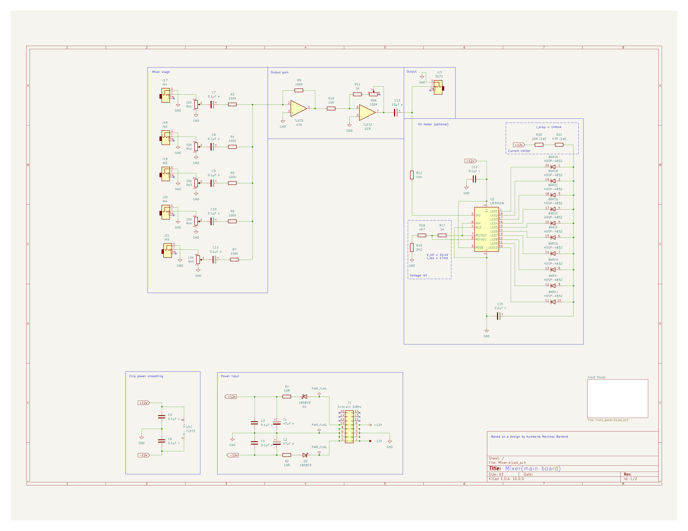

# Mixer

This design is based on the mixer by [Humberto Martínez Barberá](https://www.hackster.io/mb_humberto/eurorack-4-channel-mixer-with-vu-meter-535570). In this design I dropped the peak detection option and added an input channel as I have five VCOs that can generate source signals. I also swapped the electrolytic caps to tantalum as that's what I had on hand.
